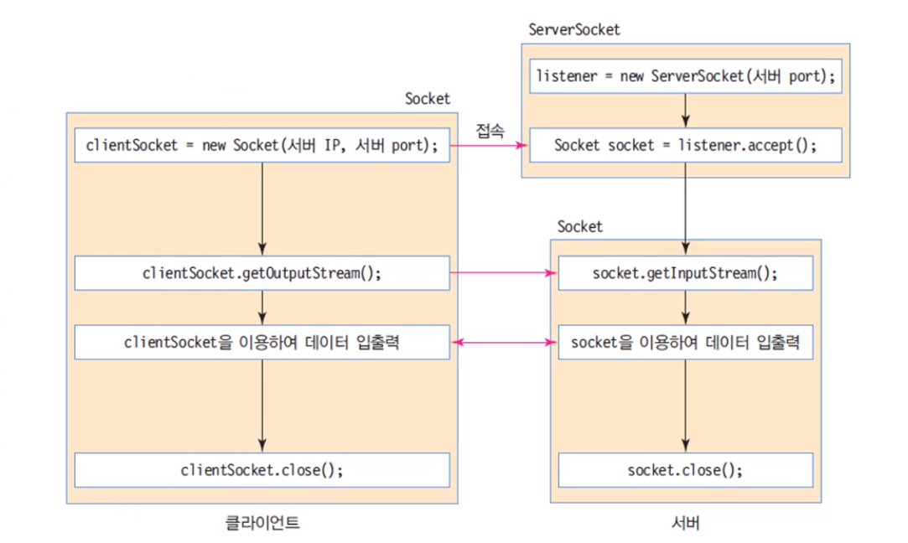

# Socket Chatting Project in JAVA

## 🖥 프로젝트 명

Socket Chatting Project

## 💡 기획 및 개발

문진혁

## ⌚ 제작 기간

2022.12.18 - 

## ⚙ 사용 기술

- **Language**: JAVA

## 세부사항

 JavaProgramming 을 수강한 후, 

 소켓을 이용한 server-client 통신 프로그램을 제작하는 것이 있어 직접 만들어보았다.

소켓프로그래밍의 순서는 다음과 같다.



### 구현

- ChatServer.Java
    
    ```java
    HashMap<String, User> clients = new HashMap<>();
    ```
    
    ```java
    Socket socket = server.accept();
    MyThread th = new MyThread(socket);
    th.start();
    ```
    
    이 코드에서는 계속해서 서버에 새로운 클라이언트가 접속할 경우 스레드가 실행이 될 것이다. 
    
    ```java
    reader = new BufferedReader(new InputStreamReader(client.getInputStream()));
    writer = new PrintWriter(client.getOutputStream(),true);
    ```
    
    ```java
    clients.put(userid,  new User(userid, reader, writer));
    Set<String> clientId = clients.keySet();
    for(String id : clientId) {
    		User user = clients.get(id);
    		user.writer.println("[" +userid + "] is connected");
    }
    ```
    
    ```java
    while(true) {
    					String msg = reader.readLine();
    					if(msg ==null || msg.equals("")) continue;
    					
    					if(msg.equals("!@#$%^&*()")) {
    						Set<String> clientUid = clients.keySet();
    						for(String id : clientUid) {
    							User user = clients.get(id);
    							user.writer.println("[" +userid + "] is disconnected");
    							
    						}
    						System.out.println("[" +userid + "] is disconnected");
    						clients.remove(userid);
    						break;
    						// disconnect
    					}else {
    						Set<String> clientUid = clients.keySet();
    						for(String id : clientUid) {
    							User user = clients.get(id);
    							user.writer.println("[" +userid + "] : " + msg);
    							
    						}
    					}
    				}
    ```
    
    **중요 문제**
    
    ```java
    Set<String> clientId = clients.keySet();
    ```
    
    ```java
    Set<String> clientUid = clients.keySet();
    ```
    
    위에 에서는 clients값을 clientId에 담아놓았지만, while문 안에서는 또 새로운 clientId라는 Set에 새로 담았다.
    
    —> while문이 돌면서 여러 클라이언트들은 disconnect를 하여 해당 clients에서 remove된다. 또는 추가가 된다. 만약 clientId 를 사용한다면 계속해서 업데이트 되는 client정보가 담겨있지 않기 때문에 오류가 일어난다. (없는 clients에게 메시지를 보낸다던지 등…) 
    

### 스크린샷


### 추후 개선사항

- 1:N 통신
    
    현재 구현한것은 1:N통신으로 해당 서버에 들어오면 무조건 그 서버의 사람들과 1:N 통신을 할 수 있다. 
    
    **만약 여기에서 카카오톡의 1:1 채팅 기능을 구현하고 싶다면?** 
    
    서버로 부터 Clients 정보를 클라이언트가 받아온 후, 해당 Client 목록을 뽑아낸다.
    
     이후 원하는 Client를 선택한다면, 서버는 자신과 선택된 Client에 대해 메시지를 주고받을 수 있는 스레드를 실행시키면 된다. 
    

## 오류

- Serializable 문제
    
    사실 다음 문제는 위에서 실행한 프로젝트에서는 String 데이터를 보내는 것이라 나오지 않았지만, 추후 개선상황에서 Clients 객체를 주고 받기 위해 코드를 짜던 중 발생하였다. 
    
    일단 직렬화란 자바에서 객체 등을 외부의 자바시스템에서 사용할 수 있도록 하기 위해 byte 형태로 변환하는 기술을 말하는 것으로, 지금까지 수강한 javaProgramming에서는 외부와 객체를 주고받지 않았다. 하지만 위 추후 개선사항에서 clients는 객체이기 때문에 이를 주고받으러면 직렬화를 해야하는 상황이 왔다. 이를 해결하기 위해 
    
    ```java
    impliments serializable
    ```
    
    을 추가시켜서 객체를 직렬화 할수 있도록 하였다. 하지만 문제는 여기뿐이 아니었다. 객체 안에 HashMap구조는 직렬화가 안되는지 계속 serializable 오류가 발생하였다.  이를 해결하기 위해 해법을 찾아본결과 HashMap 구조를 File로 내보낸 후에 받는 방법을 찾을 수 있었다.